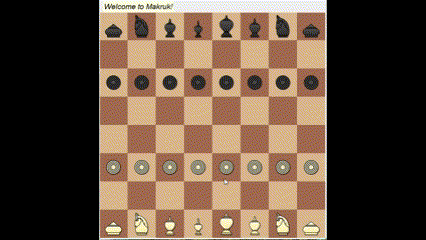

# <p align="center">Makruk AI:<br>Modernizing Thai Chess</p>

Makruk AI brings the strategic brilliance of Thai Chess into the digital era. With traditional gameplay and a planned expert AI powered by the **Minimax Algorithm**, this project is perfect for chess enthusiasts, AI researchers, and developers interested in cultural game preservation.

## Demo
<div align="center">  </div> 
<p align="center">Current progress:<br>Play Makruk with interactive Pygame-based visuals and smooth mechanics. AI opponent in development with advanced move prediction capabilities.</p>

## Features
- Classic Makruk gameplay with accurate rules
- Intuitive Pygame-based user interface for seamless play
- AI opponent (in progress) using Minimax with alpha-beta pruning
- Move highlighting for valid moves and captures

## Planned Enhancements
- Multi-level AI difficulty settings

## Installation
1. Clone the repo:
```md
git clone https://github.com/MangoStikkyRice/MakrukAI.git
```
2. Run main.py (Project is WIP)
